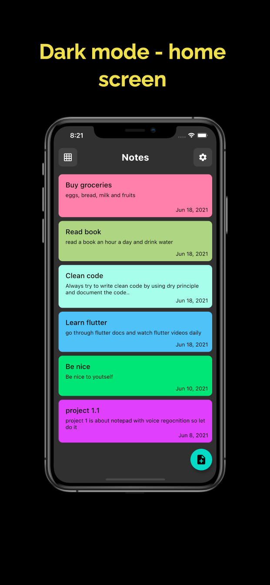
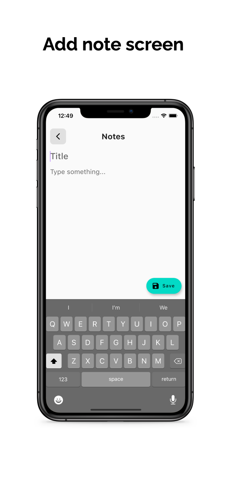
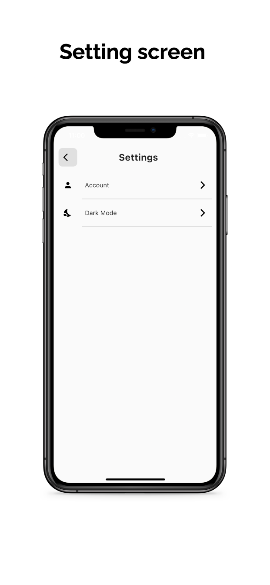
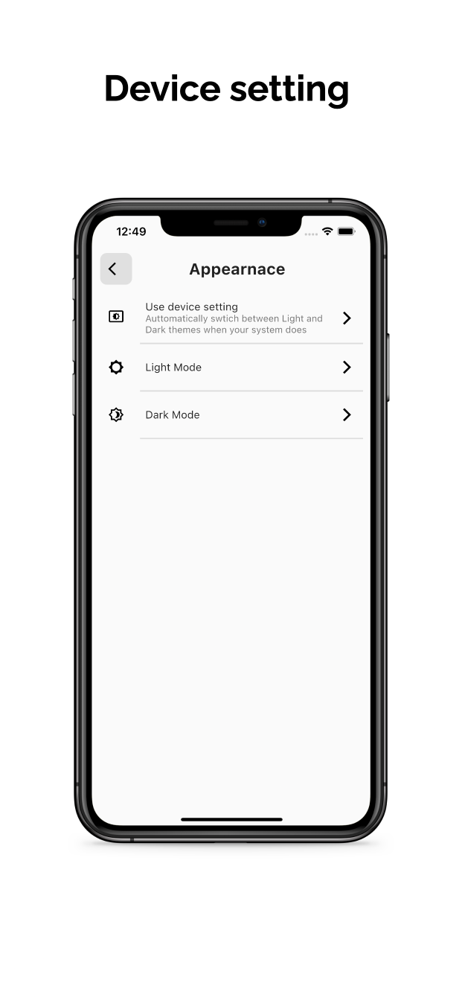
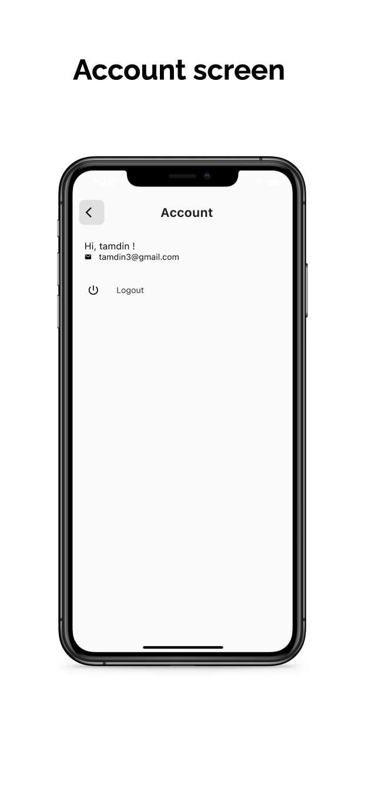
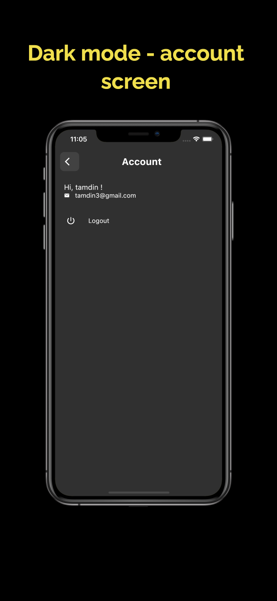

# Smart Notes (Flutter + Firebase)

Aplikasi pencatatan lintas platform dengan GetX dan Firebase. Fokus pada alur ringan: login, tulis catatan, simpan di cloud, atur tampilan grid/list, serta ubah tema terang/gelap.

## Fitur Utama
- Autentikasi email-password (Firebase Auth) dengan sesi reaktif via GetX.
- CRUD catatan realtime di Cloud Firestore per pengguna (`users/{uid}/notes`).
- Toggle tampilan list atau grid dan warna kartu acak untuk variasi visual.
- Editor catatan dengan validasi konten kosong dan peringatan ketika tidak ada perubahan sebelum keluar.
- Detail catatan: tampilkan waktu dibuat/diubah, ubah, atau hapus dengan dialog konfirmasi.
- Tema system/light/dark serta halaman akun untuk menampilkan nama, email, dan aksi logout.
- Kesiapan Google Sign-In (dependensi sudah ada, UI bisa ditambahkan kemudian).

## Tampilan Aplikasi

### Autentikasi
<p align="center">
  
  
</p>

### Halaman Utama
<p align="center">
  
  
  
</p>

### Pengaturan & Akun
<p align="center">
  
  
  
  
</p>

## Teknologi dan Plugin
- Flutter SDK 3.x (Dart >=2.17.0 <4.0.0).
- GetX untuk state management, dependency injection, dan navigasi.
- Firebase Core untuk inisialisasi, Firebase Auth untuk login email/password.
- Cloud Firestore untuk sinkronisasi catatan per pengguna.
- flutter_staggered_grid_view untuk layout grid/list dinamis.
- intl untuk format tanggal dan waktu.
- uuid untuk pembuatan ID unik dokumen.
- google_sign_in terpasang, siap dipakai jika ingin menambah login Google.

## Arsitektur Singkat
- **Entry point**: [lib/main.dart](lib/main.dart) mem-bootstrapping Firebase, mendaftarkan controller GetX, dan menyiapkan tema.
- **Routing awal**: [lib/utils/root.dart](lib/utils/root.dart) memilih layar login atau beranda berdasarkan `firebaseUser`.
- **State management**: GetX Controller
  - [lib/controllers/authController.dart](lib/controllers/authController.dart) untuk autentikasi, binding user, dan preferensi axisCount grid/list.
  - [lib/controllers/userController.dart](lib/controllers/userController.dart) menyimpan profil user aktif.
  - [lib/controllers/noteController.dart](lib/controllers/noteController.dart) streaming daftar catatan sesuai UID.
- **Layanan data**: [lib/services/database.dart](lib/services/database.dart) membungkus operasi Firestore untuk profil user dan catatan.
- **Model**: [lib/models/user.dart](lib/models/user.dart) dan [lib/models/noteModel.dart](lib/models/noteModel.dart).
- **UI**: layar autentikasi, beranda, form tambah/ubah catatan, detail catatan, dan pengaturan tema.

## Struktur Direktori Ringkas
- lib/
  - controllers/ — Auth, user, note (GetX).
  - models/ — Representasi data user dan catatan.
  - screens/
    - auth/ — Login dan Sign Up.
    - home/ — Beranda, daftar catatan, tambah/lihat catatan.
    - settings/ — Akun dan pengaturan tema.
    - widgets/ — Komponen kecil reusable.
  - services/ — Pembungkus Firestore.
  - utils/ — Root router, tema.

## Prasyarat
- Flutter SDK 3.x, Java 17+, Android SDK, dan perangkat/emulator.
- Akun Firebase dengan project untuk Android dan iOS.
- Editor favorit (VS Code/Android Studio/Xcode) dengan Flutter extension.

## Instalasi Cepat
1) Clone repo
```bash
git clone smart.notes.project
cd smart.notes.project
```
2) Pasang dependensi
```bash
flutter pub get
```
3) Konfigurasi Firebase
- Aktifkan Authentication (Email/Password) dan Cloud Firestore.
- Ganti contoh `android/app/google-services.json` dan `ios/Runner/GoogleService-Info.plist` dengan milik Anda.
- Samakan `applicationId`/`bundleId` dengan konfigurasi Firebase.
4) Jalankan aplikasi
```bash
flutter run
```
5) Build rilis (opsional)
- Android: `flutter build apk --release`
- iOS: `flutter build ios --release` (macOS dengan Xcode dan provisioning siap).

## Alur Utama Aplikasi
- Login/Sign Up: validasi dasar, tulis atau baca profil di Firestore, simpan di `UserController`.
- Beranda: stream catatan realtime, toggle grid/list dengan `axisCount` di `AuthController`.
- Tambah/Ubah: simpan catatan dengan timestamp; editor menolak konten kosong dan memberi peringatan jika tidak ada perubahan.
- Detail/Hapus: tampilkan informasi catatan, ubah atau hapus dengan dialog konfirmasi.
- Pengaturan: pilih tema system/light/dark dan logout.

## Pengujian
Jalankan tes (jika ada):
```bash
flutter test
```

## Catatan dan Tips
- Periksa rules Firestore agar hanya pemilik UID dapat membaca/menulis `users/{uid}/notes/*`.
- Jika data tidak muncul, pastikan `noteStream` menerima UID aktif (lihat binding di `NoteController`).
- Ingin login Google? UI tinggal ditambahkan karena `google_sign_in` sudah menjadi dependensi.

## Lisensi
Belum ditentukan. Tambahkan lisensi sesuai kebutuhan proyek.
